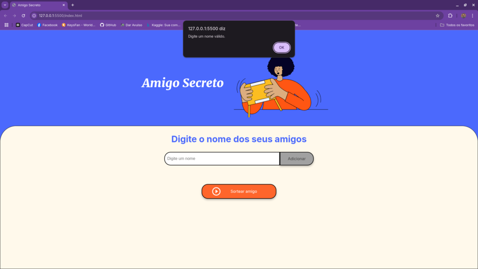
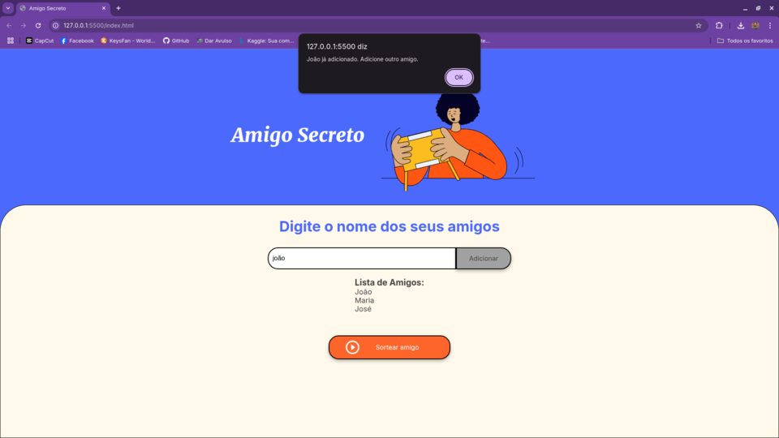
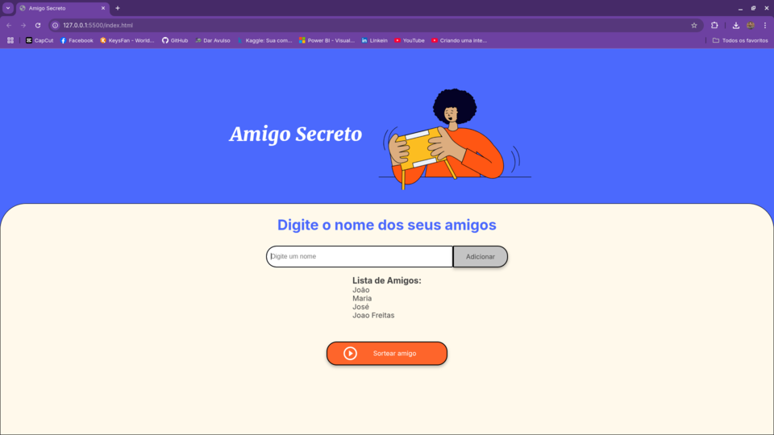
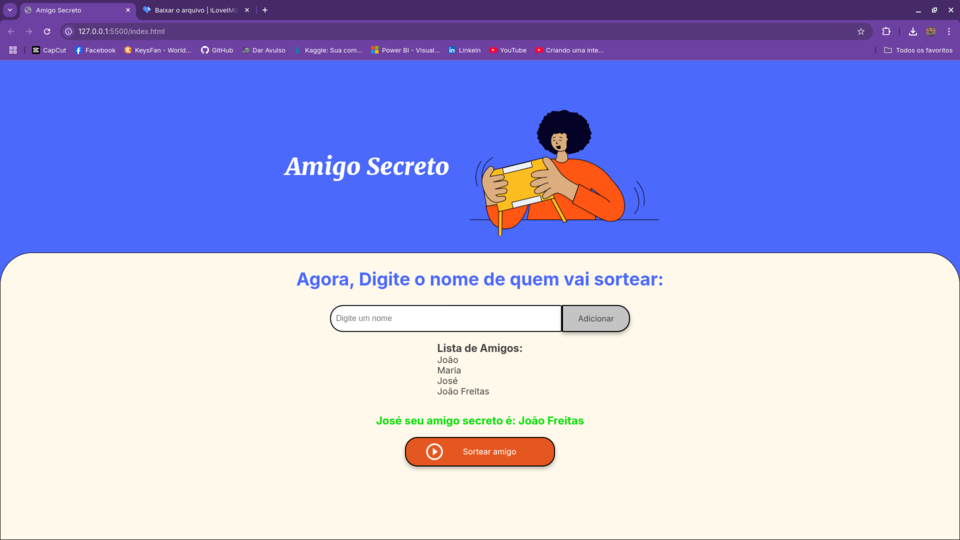
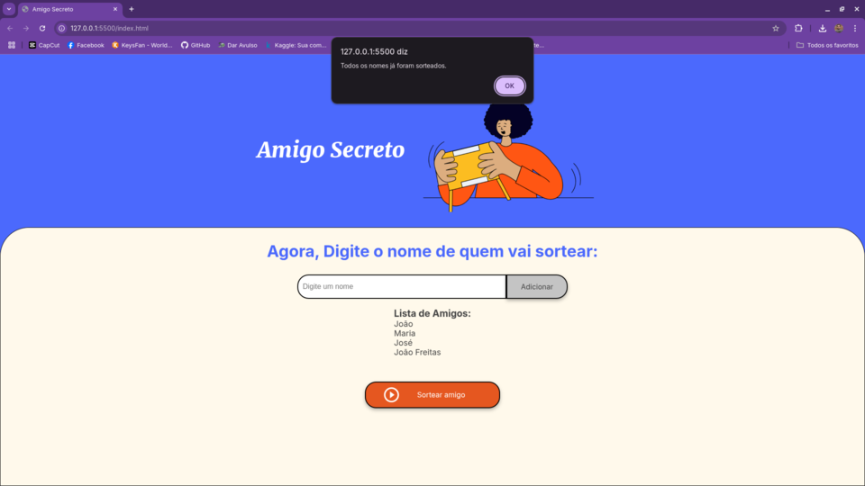

# Projeto Challenge Amigo Secreto

Bem-vindo ao **Challenge Amigo Secreto**! Aqui, você vai encontrar tudo o que precisa para entender, usar e contribuir para esse projeto.

---

## Índice

1. [Sobre o Projeto](#sobre-o-projeto)

    1.1 [Entendendo o jogo](#entendendo-o-jogo)

    1.2 [Visualizando o jogo](#visualizando-o-jogo)
2. [Tecnologias Utilizadas](#tecnologias-utilizadas)
3. [Requisitos](#requisitos)
4. [Passo a Passo](#passo-a-passo)
5. [Organizadores](#organizadores)

---

## Sobre o Projeto

Este challenge refere-se a um jogo de amigo secreto onde os participantes são adicionados a uma lista e, em seguida, sorteados aleatoriamente. O jogo começa com o usuário digitando os nomes dos amigos no campo de input e clicando em "Adicionar". Cada nome é validado para garantir que não esteja vazio, não seja um número e não tenha sido adicionado anteriormente. O usuário deve digitar o nome de quem está sorteando, em seguida, um nome é sorteado aleatoriamente, garantindo que ninguém sorteie a si mesmo e que cada nome seja sorteado apenas uma vez. O resultado é exibido na tela, e o jogo continua até que todos os nomes tenham sido sorteados.

Este projeto faz parte da trilha Iniciante em Programação G8 - ONE oferecida em parceria da Oracle com Alura.

### Entendendo o jogo

Primeiro o usuário deve digitar o nome dos participantes do amigo secreto, caso ele tente clique em adicionar sem fornecer um nome ou digitar um número, o usuário receberá uma mensagem de erro conforme mostrado abaixo:

&nbsp;&nbsp;&nbsp;&nbsp;&nbsp;&nbsp;&nbsp;&nbsp;&nbsp;&nbsp; 

Caso o usuário clique em sortear amigo sem te adicionado ao menos 3 nomes na lista receberá uma mensagem de erro conforme mostrado abaixo:

(Nota: A quantia mínima de 3 participantes deve-se ao fato de que não existe amigo secreto com 1 ou 2 participantes)

&nbsp;&nbsp;&nbsp;&nbsp;&nbsp;&nbsp;&nbsp;&nbsp;&nbsp;&nbsp; 

Durante a adição de participantes caso haja uma tentativa de adicinar uma nome repetido o usuário será impedido de adicionar e receberá uma mensagem conforme mostra a imagem abaixo:

&nbsp;&nbsp;&nbsp;&nbsp;&nbsp;&nbsp;&nbsp;&nbsp;&nbsp;&nbsp; 

Para evitar o erro de digitação de nomes iguais, sugerimos adicionar um sobrenomes em um ou mais participantes homônimos, como mostra imagem a seguir:

&nbsp;&nbsp;&nbsp;&nbsp;&nbsp;&nbsp;&nbsp;&nbsp;&nbsp;&nbsp; 

Após adicionar todos os participantes, deve-se clicar em sortear amigo para começar o sorteio, cada participante digitará seu nome, caso seja digitado um nome que não consta na lista será mostrado uma mensagem conforme imagem abaixo:

&nbsp;&nbsp;&nbsp;&nbsp;&nbsp;&nbsp;&nbsp;&nbsp;&nbsp;&nbsp; 

Assim que o sortedor digitar seu nome e clicar em Sortear amigo ele receberá uma mensagem com o nome da pessoa que foi sorteada para ele.

&nbsp;&nbsp;&nbsp;&nbsp;&nbsp;&nbsp;&nbsp;&nbsp;&nbsp;&nbsp; 

Caso um sorteador que já recebeu seu amigo secreto tente sortear novamente ele será impedido e receberá a seguinte mensagem:

&nbsp;&nbsp;&nbsp;&nbsp;&nbsp;&nbsp;&nbsp;&nbsp;&nbsp;&nbsp; 

Após todos os nomes serem sorteados o programa informa que todos osparticipantes jã sortearam seus respectivos amigo secreto.

&nbsp;&nbsp;&nbsp;&nbsp;&nbsp;&nbsp;&nbsp;&nbsp;&nbsp;&nbsp; 

### Visualizando o jogo
&nbsp;&nbsp;&nbsp;&nbsp;&nbsp;&nbsp;&nbsp;&nbsp;&nbsp;&nbsp;

[](https://youtu.be/EPAwKZcrWlc)

---

## Tecnologias Utilizadas

- **JavaScript**: Criado por Amarildo Chagas Junior
- **HTML**: Criado por equipe Alura
- **CSS**: Criado por equipe Alura

---

## Requisitos

Antes de instalar, certifique-se de ter as seguintes ferramentas:

- **VsCode** - Para visualização do código.
- **Live Server**: Extensão VsCode para visualização via Navegador Web.
- **Git** - Para clonar o repositório.

---

## Passo a Passo

1. Clone este repositório:

   ```bash
   git clone https://github.com/amarildochagasjr/OracleONE-Alura

## Organizadores:

[](https://www.alura.com.br/) **Alura** &nbsp;&nbsp;&nbsp;&nbsp; [](https://www.oracle.com/br/education/oracle-next-education/) **ONE**
